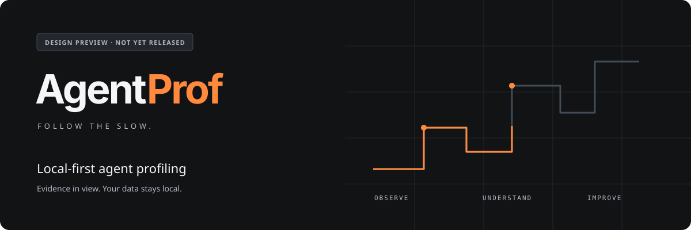

<p align="center">
  
</p>

<p align="center">
  
</p>

<p align="center">
  <strong>AI 코딩 에이전트가 어디에 시간을 쓰는지.<br>무엇을 먼저 개선할 수 있는지.</strong>
</p>

<p align="center">
  <a href="docs/SPEC.md">Product spec</a> ·
  <a href="docs/DESIGN-GUIDELINES.md">Design guidelines</a> ·
  <a href="design/README.md">Component system</a> ·
  <a href="docs/TODO.md">Roadmap</a>
</p>

## Follow the slow.

AgentProf는 Claude Code·Codex 로그의 **시간 병목, 반복 실패, 탐색·검증 패턴**을 분석하는 로컬 성능 프로파일러를 목표로 합니다. 결과에서 근거를 확인하고, 작은 개선을 고른 뒤, 같은 조건의 전후 결과를 살펴봅니다.

**현재 상태: 계획 + 디자인 기반.** 가이드라인과 재사용 컴포넌트 견본이 있으며, 파서·분석기·CLI 패키지는 아직 구현/배포되지 않았습니다. 견본의 모든 데이터는 합성 예시입니다. 아래 제품 기능과 명령은 구현 목표입니다.

| 먼저 볼 것 | 다음에 확인할 것 |
| --- | --- |
| **Time Breakdown** — 시간이 간 곳 | 관측 범위, 시간 의미, 병렬 구간과 커버리지 |
| **Detected Waste** — 반복 패턴에 연결된 시간 | 규칙·근거 구간·겹침; 실제 절감 가능한 시간과 구분 |
| **Top Insights** — 먼저 살펴볼 개선 후보 | 반복 실패·재시도와 실행 가능한 다음 행동 |

## Design preview

어두운 기술적 화면에 절제된 따뜻한 주황색. 도롱뇽은 제품의 표식이고, 수치와 근거는 화면의 중심입니다. 밝은 테마도 같은 정보 위계로 설계했습니다. 브라우저 렌더링·상호작용 검증은 현재 환경 제한으로 미실행이며, 색상 대비·정적 검사 결과는 QA 문서에 구분해 두었습니다.

- [디자인 가이드라인](docs/DESIGN-GUIDELINES.md): 시각 원칙, 두 테마, 상태·모바일·접근성 계약
- [재사용 시스템](design/README.md): semantic CSS tokens, native HTML primitives, 최소 vanilla 동작
- 오프라인 견본: 저장소를 내려받고 `node design/build.mjs` 실행 후 생성된 `design/showcase.html`을 브라우저로 열기. 빌드 결과는 Git에 넣지 않습니다
- [검증 기록](docs/DESIGN-QA.md): 실제 확인한 화면·상태와 남은 한계

견본은 나중의 로컬 리포트와 대시보드에서 재사용할 디자인 기반입니다. 현재 서버·watcher·실시간 대시보드는 포함하지 않습니다.

## Intended workflow

아래는 **미배포 기능의 예정 명령**이며, 현재 `npx agentprof` 설치를 안내하는 것이 아닙니다. 공개 패키지명·등록 권한은 출시 전에 확인합니다.

```bash
# Planned workflow — not available yet
agentprof scan
agentprof stats --last 7d
agentprof insights --last 7d
agentprof report --last 7d --output ./agentprof.html --open
```

초기 구현 계획은 TypeScript · Node.js ≥24.15.0 · SQLite · 단일 오프라인 HTML입니다. npm 일회성 실행과 전역 설치를 검증한 뒤 공개합니다. `node:sqlite`는 Release candidate API로 취급하며 최소 런타임·설치 검증을 먼저 수행합니다. Homebrew와 Rust는 후속 검토입니다.

## Honest by design

- **Unknown ≠ zero.** 측정·관측·추정·미지원과 표본·분모·커버리지를 구분합니다
- **Slow ≠ waste.** 느리거나 비중이 큰 도구만으로 낭비라고 단정하지 않습니다
- **Overlaps count once.** 병렬 호출·wrapper와 여러 진단의 같은 시간 구간을 중복 합산하지 않습니다
- **Local first.** 분석은 로컬에서 끝나도록 설계합니다. 자동 업로드·텔레메트리와 원문 프롬프트·소스·도구 출력의 기본 저장은 없습니다
- **Evidence before claims.** 지원되지 않는 지표를 숫자로 채우거나 절감·인과 효과를 보장하지 않습니다

v0.1 목표는 10개 지표·6개 진단과 수동 matched before/after 파일럿입니다. 자동 비교 UI·설정 변경 추적은 v0.2입니다.

## Roadmap

1. **P0–P3 · Can we observe it?** 로컬 실로그 의미·버전별 coverage, 합성 기대값, 원문 폐기 전 정규화
2. **P4–P5 · Can we trust it?** 증분 저장, 시간·실패·재시도의 최소 CLI/HTML, 지표·진단과 오탐 검증
3. **P6–P7 · Can we use it?** 오프라인 상세 화면, 설치·자원 예산·로컬 파일럿

[8개 구현 이슈](https://github.com/WhiteKiwi/agentprof/issues)와 [v0.1-alpha](https://github.com/WhiteKiwi/agentprof/milestone/1) · [v0.1](https://github.com/WhiteKiwi/agentprof/milestone/2) 마일스톤이 있습니다. 세부 단계·검증 기준은 유지 관리 문서를 우선하며 기존 이슈 본문의 동기화는 별도 작업입니다. 디자인 견본 완성을 P5/P6 제품 구현 완료로 세지 않습니다.

## Documentation

| Document | Purpose |
| --- | --- |
| [SPEC](docs/SPEC.md) | 제품 목표·관측 가능한 동작·범위 |
| [FINDINGS](docs/FINDINGS.md) | 조사 근거·결정·불확실성 |
| [ARCHITECTURE](docs/ARCHITECTURE.md) | 데이터·저장·개인정보 경계 |
| [METRICS](docs/METRICS.md) | 10개 지표·6개 진단·시간 회계 |
| [IMPLEMENTATION](docs/IMPLEMENTATION.md) | 구현 순서·접근·검증 |
| [TODO](docs/TODO.md) · [ACCEPTANCE](docs/ACCEPTANCE.md) | 진행 상태와 실제 실행 증거 |
| [DESIGN](DESIGN.md) · [Guidelines](docs/DESIGN-GUIDELINES.md) | 간결한 실행 규칙과 디자인 판단 근거 |
| [Brand references](docs/DESIGN.md) · [BACKLOG](docs/BACKLOG.md) | 제공 이미지·후속 아이디어 |
| [AGENTS](AGENTS.md) | 문서 우선·구현 세션·Git 작업 방식 |

## Brand direction · provisional

<p align="center">
  
</p>

마스코트는 **Salamander / 도롱뇽**입니다. 제공한 dark/technical 이미지에서 분위기를, 평면 도롱뇽에서 작은 식별 마크를 참고했습니다. 현재 logo/favicon은 임시 적용이며 최종 벡터 로고를 확정한 것은 아닙니다. [원본·선택·사용 범위](docs/DESIGN.md)를 함께 기록합니다.

원문 제안은 [AgentTrace](docs/reference/agenttrace-design.md)와 [AgentProf metrics](docs/reference/agentprof-metrics-and-insights.md)에 보존합니다. 원문의 데모 숫자·범위보다 유지 관리 사양이 우선합니다.
