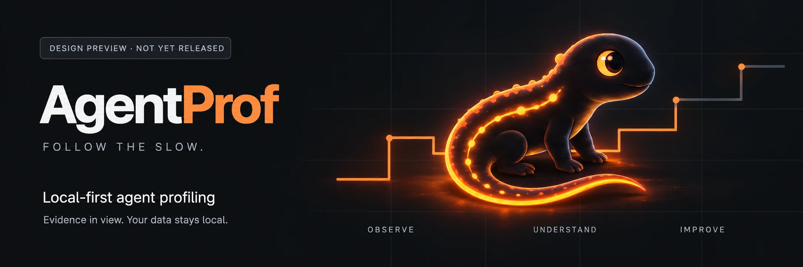

<p align="center">
  
</p>

<p align="center">
  <strong>See where your coding agent spends its time.<br>Find what to improve next.</strong>
</p>

<p align="center">
  <a href="docs/SPEC.md">Product spec</a> ·
  <a href="docs/DESIGN-GUIDELINES.md">Design guidelines</a> ·
  <a href="design/README.md">Component system</a> ·
  <a href="https://github.com/WhiteKiwi/agentprof/issues">Roadmap</a>
</p>

## Follow the slow.

AgentProf is a planned local-first performance profiler for Claude Code and Codex logs. It connects **time hotspots, repeated failures, and exploration and validation patterns** to evidence you can inspect and small changes you can test.

The goal is to **reduce tokens and task elapsed time while preserving output quality**. Start with trustworthy measurements, choose one improvement, and compare the same kind of work under matched conditions.

**Current status: planning and design foundations on main.** The repository includes guidelines and reusable component examples. Provider parsers, the analyzer, and the CLI package are not implemented or released on main. All design-preview data is synthetic. The features and commands below describe the intended product.

As of September 30, 2026, [draft PR #9](https://github.com/WhiteKiwi/agentprof/pull/9) separately contains P0 research and P1 CLI, privacy, bounded-reader, and SQLite foundations. It is not merged. Its analysis commands still return `NOT_IMPLEMENTED`; foundation tests do not establish working profiling or verified savings. See the [measurement review](docs/FINDINGS.md) for revision-specific evidence.

| Start here | Then inspect |
| --- | --- |
| **Time Breakdown** — where time went | Observation boundaries, timing meaning, parallel intervals, and coverage |
| **Detected Waste** — time associated with repeated patterns | Rules, evidence intervals, and overlap; this is not proven avoidable time |
| **Top Insights** — what to investigate next | A concrete action, a validation experiment, and quality guardrails |

The [measurement contract](docs/METRICS.md#aggregation-and-token-accounting) separates task elapsed time, observed turn time, accumulated session-minutes, and tool-duration sums. It also defines unique final token usage, provider-specific cache accounting, and coverage. Missing data stays unknown.

The [six improvement candidates](docs/METRICS.md#efficiency-opportunity-cards) cover large outputs, repeated searches, overly broad validation, repeated failures, context growth, and duplicated parallel work. These are candidate categories, not six newly implemented rules. New automatic detection for large outputs, context growth, and parallel duplication remains future scope.

## Design preview

A dark technical interface with restrained warm-orange accents. The salamander is the product mark; measurements and evidence stay at the center. The light theme follows the same hierarchy.

- [Design guidelines](docs/DESIGN-GUIDELINES.md): visual principles, both themes, responsive states, and accessibility
- [Reusable system](design/README.md): semantic CSS tokens, native HTML primitives, and minimal vanilla interactions
- Offline showcase: download the repository, run `node design/build.mjs`, then open the generated `design/showcase.html` in a browser. The generated file is not committed
- [QA record](docs/DESIGN-QA.md): completed checks and remaining limitations

Browser rendering and interaction checks are recorded separately from static and color-contrast checks. The showcase is a design foundation for a future local report and dashboard. It is not connected to a working profiler, and it does not include a server, watcher, or live dashboard.

## Intended workflow

These are **planned, unreleased commands**, not instructions to install `npx agentprof` today. The public package name and publishing rights must be confirmed before release.

```bash
# Planned workflow — not available yet
agentprof scan
agentprof stats --last 7d
agentprof insights --last 7d
agentprof report --last 7d --output ./agentprof.html --open
```

The initial implementation plan is TypeScript, Node.js ≥24.15.0, SQLite, and a single offline HTML report. One-off npm execution and global installation must be verified before public release. `node:sqlite` is treated as a Release candidate API, with explicit runtime and installation checks. Homebrew and Rust are later considerations.

## Development

The repository pins Node 24.21.0 and pnpm 10.34.6 with mise. Review and trust the checked-in tool configuration, then run:

```bash
mise trust
mise install
mise exec -- pnpm install --frozen-lockfile --ignore-scripts
mise exec -- pnpm check
# Build and package with the ordinary npm prepack lifecycle enabled.
mise exec -- npm pack
```

Dependency installation disables lifecycle scripts. Packaging runs the repository's explicit build. npm remains the distribution channel; an installed CLI needs a supported Node runtime and its runtime dependencies. See [toolchain qualification](docs/TOOLCHAIN.md) for the supported CI matrix, artifact checks and verification limits. Historical npm commands in evidence documents describe the recorded runs.

## Honest by design

- **Unknown ≠ zero.** Distinguish direct, observed, inferred, and unsupported values, with sample sizes, denominators, and coverage
- **Slow ≠ waste.** A slow or high-share tool is not automatically unnecessary
- **Overlaps count once.** Separate duplicate representations from real parallel executions, then union eligible elapsed intervals
- **Tokens need context.** Count unique final usage once. Keep cache semantics, output-size estimates, and unattributed usage explicit
- **Local first.** Analysis is designed to stay local, without automatic uploads or telemetry. Raw prompts, source, commands, and tool outputs are excluded from stored analysis and reports
- **Quality comes first.** Keep required tests, evidence, and review standards when evaluating a faster or smaller workflow
- **Evidence before claims.** Do not fill unsupported metrics with invented numbers or promise savings or causal effects

The v0.1 target is 10 metrics, 6 diagnostic rules, and a manual [quality-preserving before/after pilot](docs/ACCEPTANCE.md#quality-preserving-improvement-pilot). The pilot records unchanged results, quality regressions, and incomparable runs as well as observed improvements. Automated comparison UI and configuration-change tracking are v0.2 scope.

## Roadmap

1. **P0–P3 · Can we observe it?** Validate local-log semantics and version-specific coverage, define synthetic expectations, and normalize before discarding raw data
2. **P4–P5 · Can we trust it?** Build incremental storage, a minimal time/failure/retry CLI and HTML path, metrics, and diagnostics with false-positive checks
3. **P6–P7 · Can we use it?** Add offline evidence navigation, installation and resource-budget verification, and a local pilot

The [implementation priorities](docs/IMPLEMENTATION.md#efficiency-review-priorities) put freshness and coverage before hotspots, actionable suggestions, and matched verification. [GitHub Issues](https://github.com/WhiteKiwi/agentprof/issues) track the work, with task checklists, owners, dependencies and concrete Verify entries. Follow the [tracking and claim rules](docs/TODO.md); each session owns one active ticket. This replaces the earlier Project-only workflow. The [historical Project](https://github.com/users/WhiteKiwi/projects/2) retains dated records.

Maintained planning documents define the detailed scope and verification criteria. Keep each issue synchronized with its plan. Close it as completed only after its own verification passes and its PR merges; a narrow child does not complete broader product acceptance. Completing the design showcase does not complete P5/P6 product implementation.

## Documentation

The README is in English. Detailed planning and research documents are currently in Korean.

| Document | Purpose |
| --- | --- |
| [SPEC](docs/SPEC.md) | Product goals, observable behavior, scope, and capability snapshot |
| [FINDINGS](docs/FINDINGS.md) | Dated evidence, official references, decisions, and uncertainty |
| [ARCHITECTURE](docs/ARCHITECTURE.md) | Data flow, storage, identity, and privacy boundaries |
| [METRICS](docs/METRICS.md) | Metrics, diagnostic rules, aggregation, and improvement cards |
| [IMPLEMENTATION](docs/IMPLEMENTATION.md) | Implementation order, trade-offs, and verification |
| [GitHub Issues](https://github.com/WhiteKiwi/agentprof/issues) · [Tracking rules](docs/TODO.md) | Issue ownership, progress, dependencies, checklists, and Verify entries |
| [ACCEPTANCE](docs/ACCEPTANCE.md) | Recorded product and foundation verification evidence |
| [DESIGN](DESIGN.md) · [Guidelines](docs/DESIGN-GUIDELINES.md) | Concise execution rules and design rationale |
| [Brand references](docs/DESIGN.md) · [BACKLOG](docs/BACKLOG.md) | Supplied artwork and deferred ideas |
| [AGENTS](AGENTS.md) | Documentation-first workflow and repository conventions |

## Brand direction · provisional

<p align="center">
  
</p>

The mascot is a **salamander**. The supplied dark, technical reference informs the atmosphere; the flat salamander informs the compact mark. The current logo/favicon direction is provisional, not a finished vector identity. [Sources, choices, and usage boundaries](docs/DESIGN.md) are documented.

The original [AgentTrace proposal](docs/reference/agenttrace-design.md) and [AgentProf metrics proposal](docs/reference/agentprof-metrics-and-insights.md) are preserved. Maintained specifications take precedence over their illustrative numbers and proposed scope.
