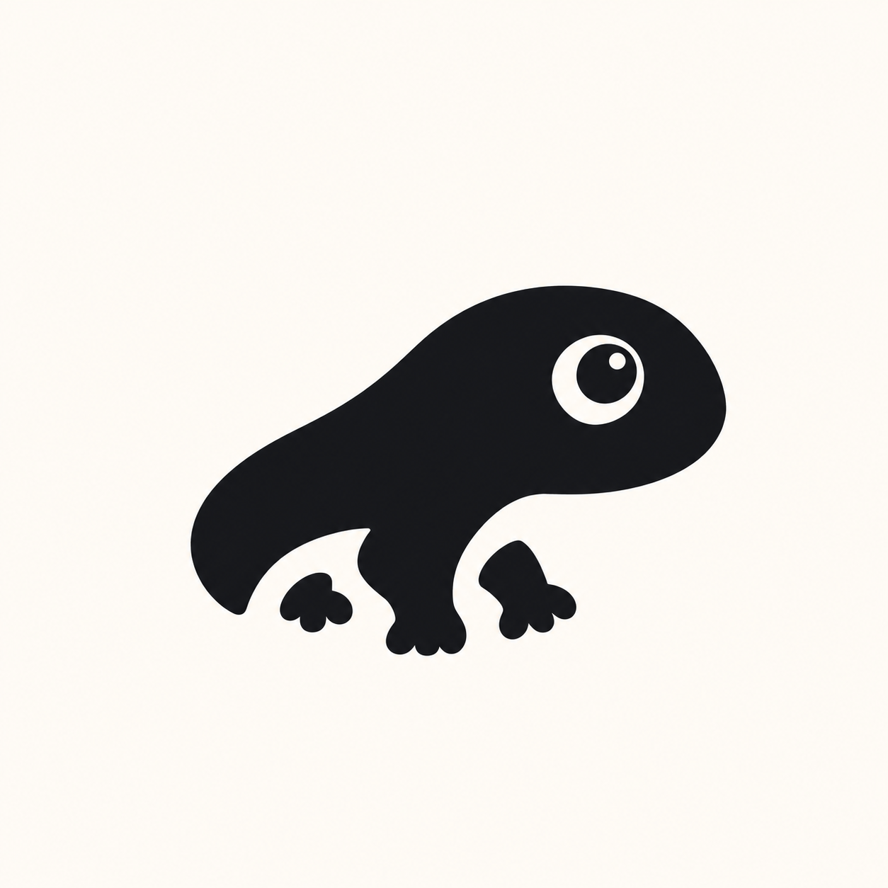
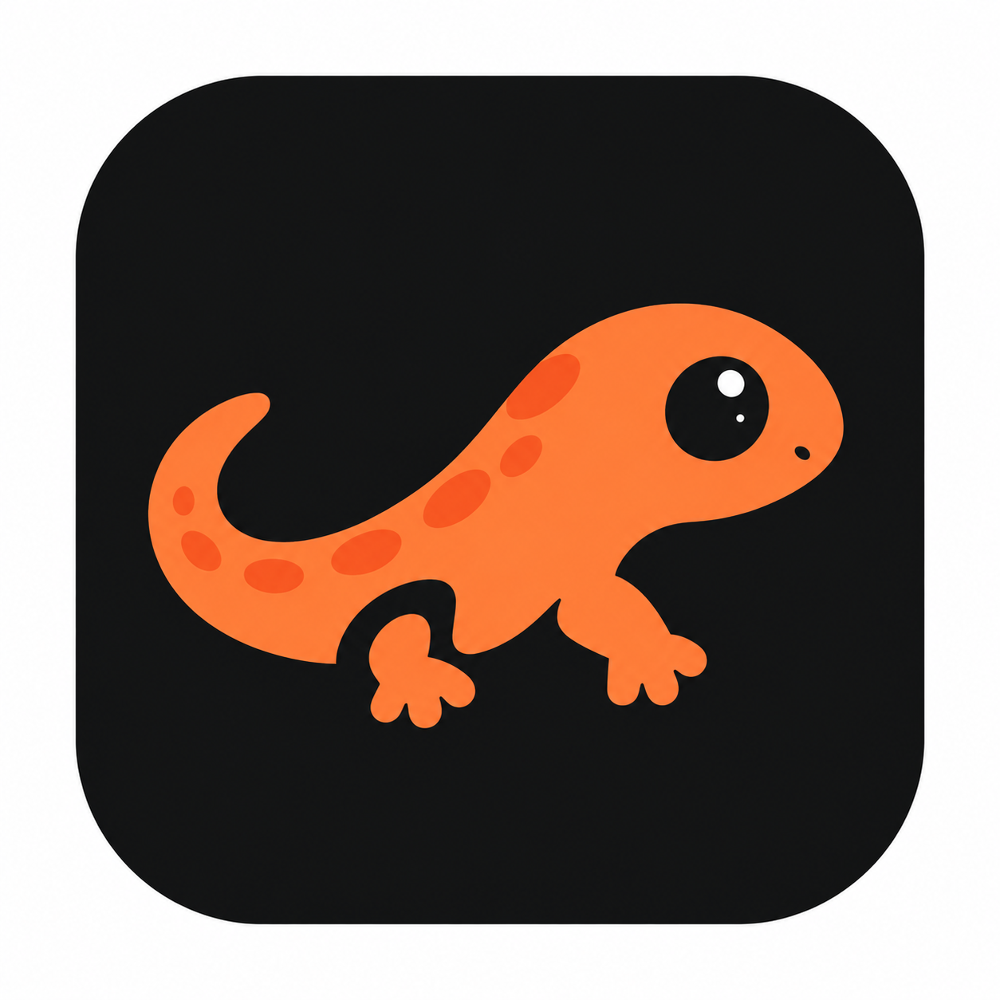
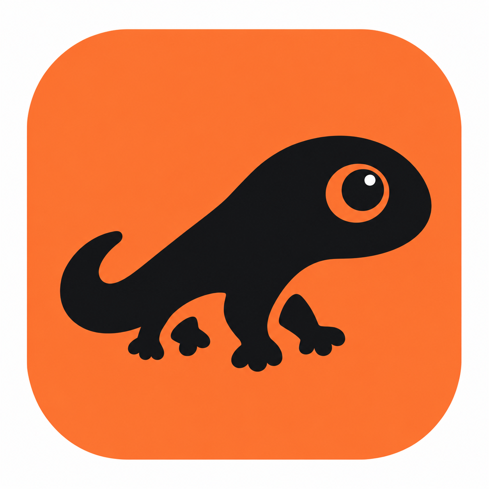

# AgentProf Brand Assets and References

2026-09-30 · Mascot inherited; compact mark selection provisional

## Current design system

Canonical decisions: [DESIGN-GUIDELINES.md](DESIGN-GUIDELINES.md). Concise implementation contract: [root DESIGN.md](../DESIGN.md). Reusable specimen: [design/README.md](../design/README.md). Verification: [DESIGN-QA.md](DESIGN-QA.md).

The mascot is **Salamander / 도롱뇽**, as selected by the user. The new reference shows a dark technical atmosphere, glowing orange trace, white/orange AgentProf wordmark and “FOLLOW THE SLOW.” The report carries the warmth in a restrained brand accent; its data does not glow or inherit orange as an error color.

The four new attachments were pixel-inspected locally as references. Their duplicate binary uploads are not part of this commit. The existing dark-field orange salamander, `assets/reference/salamander2.png`, is reused unchanged as the provisional compact mark and PNG favicon. It has a white outer margin and is not a newly cropped or vectorized logo. Small-size browser legibility remains NOT RUN, not an approval.

The supplied trace-style reference informs the charcoal/orange atmosphere and tagline. The separate README cover is original native vector layout/type and a trace motif; it does not redraw the mascot.

## Earlier repository references — preserved

The initial reference files remain unchanged. The existing `salamander2.png` was retrieved and pixel-inspected during this pass; its visual composition matches the newly supplied dark/orange direction, but its bytes differ, so the new attachments do not overwrite it.

| Reference 1 | Reference 2 | Reference 3 |
| --- | --- | --- |
|  |  |  |

Earlier originals came from Downloads and were preserved without modification. Their presence never established a final logo, exact palette or release-ready favicon.

## Asset rules

- Keep supplied original pixels and filenames traceable; never replace the originals with an edit.
- Use modest branding in the report header. Time Breakdown, Detected Waste and Top Insights retain priority.
- Include report assets locally/inlined; no remote image request.
- The brand reference is not a background for critical text or a data encoding.
- Logo finalization, vector master and custom small-size optical variants remain future decisions. This scaffold does not invent their approval.
- Source checksum and available render/measurement evidence are in [DESIGN-QA.md](DESIGN-QA.md).
